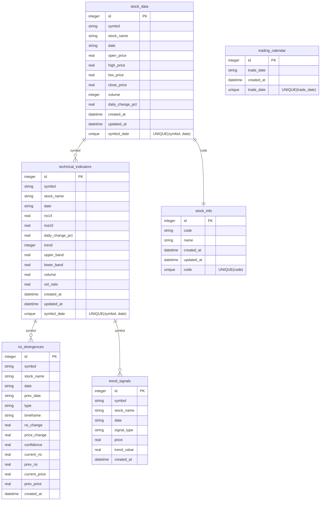
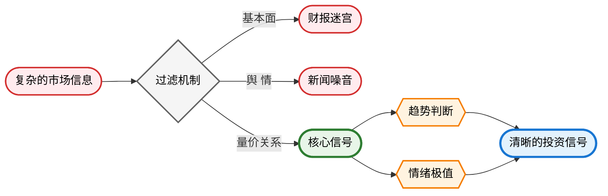

## PulseTrader - 探讨 AI 量化投资的正确方向

在当今快速变化的金融市场中，我注意到一个吊诡的现象：**市面上许多 AI 量化工具似乎在关键环节上偏离了正确方向**。

### 核心理念
> **数据神圣不可侵犯，必须用 100% 可靠的算法来承接。**

**为什么现有工具偏离正确方向？**
- 让概率替代确定性：把财务数据交给推理处理
- 用信息掩盖信号：沉迷舆情与财报，忽略量价关系
- 错置分工：让 AI 做计算，人来意会

**PulseTrader 的正确姿势：**
- **算法保底精确**：所有技术指标 100% 可验证、可复现
- **量价优先分析**：用量价关系和相对强度刻画情绪，用 SuperTrend 捕捉趋势
- **化繁为简设计**：少量稳健规则抵抗过拟合，回归量价分析本质
- **AI 负责洞察**：智能分析与呈现，降低门槛、提高可得性

## ⚖️ 精确计算与智能洞察的完美平衡

PulseTrader 采用**分离式架构设计**，确保计算的绝对精确性和 AI 辅助的智能化：

### 技术架构


**核心特性**：
- **统一数据库**：SQLite 一库统管，6 张数据表科学设计，消除重复存储
- **精确计算**：100% 可靠算法，数据完整性检验 + Wilder 等确定性算法
- **智能缓存**：增量更新、快速查询，内置交易日历避免无效请求

### 数据库表结构设计



### AI 智能分析层

**Agent Z 交易助手**的核心能力：
- **量价核心**：重视脉冲、背离等关键信号模式
- **信号聚焦**：极端条件深入分析，常规范围让图表说话
- **左侧交易偏好**：在弱势中寻找机会，避免追涨
- **确定性偏好**：信号冲突时优选等待
- **动态仓位管理**：基于 Kelly 准则的渐进式建仓和分层止损策略

### 化繁为简的设计理念



**可视化特点**：默认采用对数坐标——用距离表示百分比，跨数量级比较更可靠；交互式图表一键切换周期

## 🧐 一个真正好用的量化投资工具

### 核心优势

**数据精确性**：100% 算法可靠，每个计算结果可手工验证，LLM 推理与数据计算完全分离

**实用性导向**：目标是清晰可执行的交易计划，而非好看的回测曲线

**简化设计**：
- 极简交互：输入股票名称即开始分析
- 对数坐标：用距离代表百分比，相同倍数 = 相同高度，长期趋势与复利一眼可读
- 人性量化：RSI 背离检测捕捉情绪临界点

## 🚀 快速开始

该项目的分析模块需要 AIHUBMIX API KEY，先到 [Aihubmix 官网申请](https://aihubmix.com/token)。

```bash
# 克隆仓库
git clone https://github.com/jerlinn/PulseTrader.git
cd PulseTrader

# 安装依赖
pip install -r requirements.txt

# 配置系统环境变量
# 例如，在 ~/.zshrc 中加入
export AIHUBMIX_API_KEY="在上面申请的密钥"

# 运行指令使其生效
source ~/.zshrc
```

### 使用方式

#### 🎯 All-in-One 模式（推荐）

```bash
# 交互式分析（推荐新用户）
python pulse_trader.py

# 直接分析指定股票
python pulse_trader.py --stock "杭钢股份"

# 仅技术分析（无 AI）
python pulse_trader.py --stock "东方电气" --no-ai
```

#### 🔧 独立组件模式

```bash
# 技术分析组件
python TrendInsigt.py

# AI 分析组件
python analysis.py --chart figures/股票名_PulseTrader_日期.png

# 数据查询工具
python indicators_query.py 杭钢股份 --export
```

#### 🤖 AI 分析定制

```bash
# 指定分析上下文
python analysis.py --context "今日减仓比例指导"
python analysis.py --context "分析突破有效性，判断追涨时机"
```

## 📖 项目结构

```
PulseTrader/
├── pulse_trader.py             # 🚀 All-in-One 集成脚本（推荐入口）
├── TrendInsigt.py              # 技术分析组件（可独立运行）
├── analysis.py                 # AI 分析组件（可独立运行）
├── analyst_prompt.md           # AI 分析师 system prompt
├── plotting_component.py       # 绘图组件（对数坐标可视化）
├── rsi_component.py            # RSI 计算与背离检测
├── supertrend_component.py     # SuperTrend 指标计算
├── stock_data_provider.py      # 数据提供者接口
├── stock_cache.py              # 统一数据库管理（SQLite）
├── indicators_storage.py       # 技术指标计算和存储
├── indicators_query.py         # 数据查询和导出工具
├── cache/
│   └── stock_data.db           # SQLite 数据库（统一存储）
├── figures/                    # 生成的图表文件
├── reports/                    # AI 分析报告（Markdown）
├── USAGE_PULSE_TRADER.md       # All-in-One 脚本详细使用指南
├── USAGE_INDICATORS_STORAGE.md # 数据存储系统文档
└── requirements.txt            # 项目依赖
```

**层次设计**：
- **集成层**: `pulse_trader.py` - 统一入口
- **分析层**: `TrendInsigt.py` + `analysis.py` - 独立组件
- **计算层**: `rsi_component.py` + `supertrend_component.py` - 核心算法
- **数据层**: `stock_data_provider.py` + `stock_cache.py` - 数据管理

## Todo
- [x] 组件化
- [x] 对接 LLM
- [x] 构建场域，影响 LLM 行为
- [x] prompt 层面大幅简化报告，提升可操作性和易读性
- [x] 数据库统计和管理功能
- [x] 数据交互设计优化：股票名称 → 数据和图表 → LLM → 报告
- [x] 分析时可以传入用户的其他上下文，如具体的问题或额外信息
- [x] 数据结构优化，实现数据持久化机制
- [x] 数据传递：补充交易量和量比的存储和传递
- [x] 修复非交易日获取数据时的处理异常
- [x] 对于除权除息日这种边缘情况，用 XD 前缀去匹配
- [x] All-in-one 脚本
- [ ] 引入高量柱和地量标记
- [ ] H 股支持

## 🤝 贡献指南

欢迎所有形式的贡献！无论你是想报告 bug、提出功能建议、改进文档还是提交代码。
请查看 [CONTRIBUTING](CONTRIBUTING.md) 了解详情。

## ⚠️ 免责声明

**本项目仅供学习、研究和技术交流使用，不构成任何投资建议。**

- **非投资建议**：所有分析结果均不构成投资建议，投资决策风险自担
- **学习用途**：作为 AI 与量化分析的教育工具，用于算法研究和技术交流
- **技术限制**：不保证数据源完整性，不应用于实盘交易决策
- **合规使用**：用户应遵守当地法规，与专业投资顾问咨询后再做决策

## 📄 许可证

本项目采用 **GPL-3.0 许可证**，详见 [LICENSE](LICENSE) 文件。

- **完全开源**：代码公开透明，个人学习研究完全自由
- **商业使用**：需遵循 GPL-3.0，衍生作品必须同样开源
- **核心价值**：推动行业正确发展，建立开放透明的投资工具生态

## 🔗 关注作者

**Follow** [@eviljer](https://x.com/intent/follow?screen_name=eviljer) 获取更多 AI 玩法。
