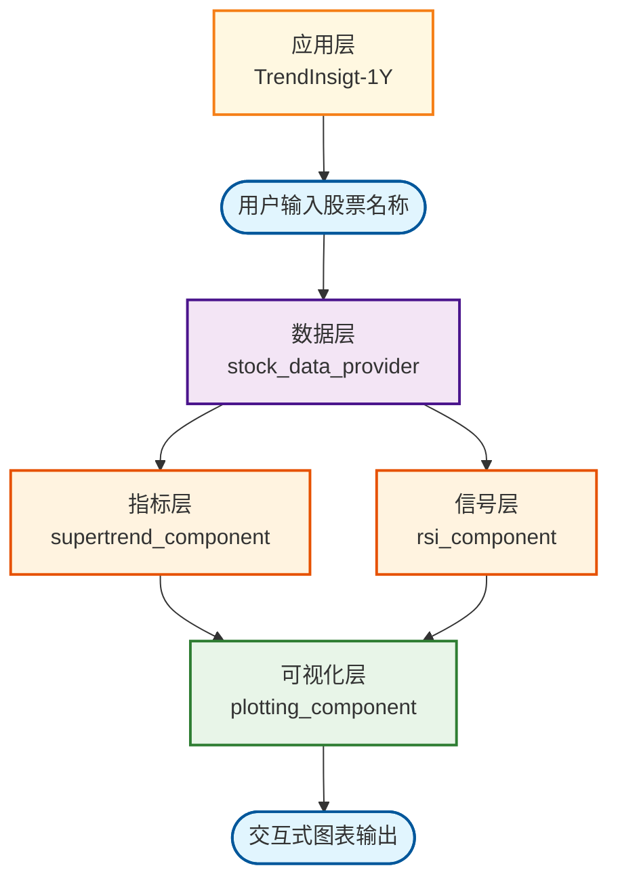
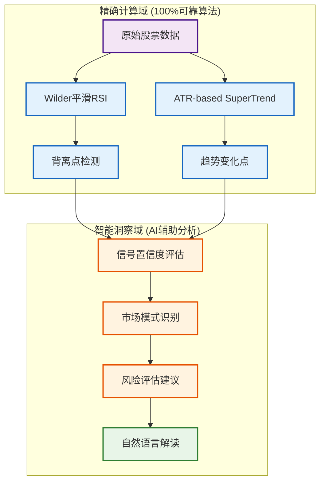
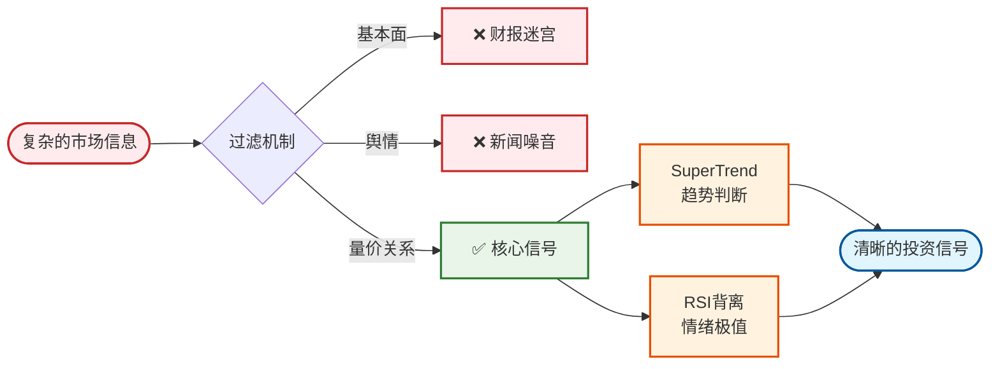

# TrendSight - AI 增强的量化投资工具

## 🔥 重新定义 AI 量化投资的正确方向

在当今快速变化的金融市场中，我发现了一个严重的问题：**市面上的 AI 量化工具完全走错了方向**。

### 当前市场的根本性错误
- **盲目迷信概率模型**：试图让 AI 接管所有计算和分析，忽略了金融数据的神圣性
- **数据精度的妥协**：用推理和预测来处理需要绝对准确的财务数据
- **信息过载陷阱**：追踪无穷无尽的舆情新闻，分析真假难辨的消息面
- **基本面迷信**：沉迷于复杂的财务报表，忽略了市场最直接的语言——价格和成交量
- **本末倒置**：让 AI 做计算，人做判断，这是对各自优势的严重误用

### 核心理念
> **数据神圣不可侵犯，必须用 100% 可靠的算法来承接**

我坚信：
- **精确计算是基础**：所有技术指标和数据处理必须保证 100% 的准确性
- **AI 负责洞察**：AI 应该专注于提供市场洞察和行为指引
- **量化人性是关键**：通过价格和成交量这一市场最纯粹的语言，直接量化人性的贪婪与恐惧
- **聚焦数学本质**：相对强度指标揭示市场情绪的数学规律，SuperTrend 捕捉趋势的几何特征
- **基本面终将显现**：无论多复杂的基本面，长期来看都会完整反映在量价关系中
- **化繁为简**：通过数据分析和可视化的方法沉淀，大幅降低用户负担
- **开源共享**：让更多人能够获得正确的量化投资工具和方法

通过开源这套经过实战验证的方法，我们希望：
- 推动行业的正确方向，回归数据精确性和量价分析的本质
- 帮助投资者摆脱信息过载，专注于市场最本真的信号
- 通过简洁优雅的设计降低量化投资的门槛
- 建立一个注重数学严谨性和人性洞察的投资社区

## ⚖️ 精确计算与智能洞察的完美平衡

TrendSight 采用**分离式架构设计**，确保计算的绝对精确性和 AI 辅助的智能化：

### 核心技术架构



### 精确计算引擎（100% 可靠算法）
- **严格数据验证**：每一个数据点都经过完整性和准确性检查
- **确定性算法**：使用Wilder平滑法等经典算法，确保结果的可重现性
- **零近似计算**：SuperTrend、RSI等所有指标计算都使用精确数学公式
- **多时间框架验证**：短期、中期、长期三层验证机制过滤假信号

### 智能洞察层（AI负责解读）



- **信号置信度评估**：AI量化每个交易信号的可靠性
- **市场模式识别**：基于历史数据识别相似的市场环境
- **风险评估建议**：提供个性化的风险管理指引
- **预留LLM接口**：支持自然语言解读复杂市场信号

### 化繁为简的设计理念



- **一目了然的可视化**：对数坐标系统，直观展现价格变化本质
- **量价关系主导**：以量价关系为主要量化依据，用容易理解的 SuperTrend 和相对强度做辅助，快速过滤出实用信息
- **交互式操作**：一键切换时间周期，无需复杂配置
- **渐进式学习**：从基础概念到高级策略，循序渐进

## 🎁 一个真正好用的量化投资工具

### 对数据精确性的承诺
- **100% 算法可靠性**：每个计算结果都可以手工验证和复现
- **零容忍近似值**：拒绝"差不多就行"的模糊计算
- **透明化流程**：所有计算逻辑完全开源，接受社区审查
- **严格测试覆盖**：确保边界条件下的计算准确性

### 为普通投资者而设计
- **极简交互**：输入股票名称即可开始分析，无需追踪复杂新闻和财报
- **专业图表**：对数坐标系直观展现价格波动本质，摆脱信息噪音干扰
- **人性量化**：RSI背离检测直接捕捉市场贪婪与恐惧的临界点
- **数学严谨**：严格阈值（顶背离80，底背离20/30）过滤90%情绪化假信号
- **置信度量化**：每个信号都有明确的可靠性评分，避免盲目跟风

### 开发者友好的架构
- **模块化设计**：plotting、RSI、SuperTrend三大组件独立可复用
- **清晰接口**：每个函数都有明确的输入输出定义
- **易于扩展**：标准化的组件接口，方便添加新指标
- **详尽文档**：从安装到自定义开发的完整指南

### 适合这些朋友
- **投资新手**：想学习量化方法但被复杂工具劝退的朋友
- **技术爱好者**：希望了解 AI 与投资分析正确结合方式的开发者  
- **实战投资者**：需要可靠技术指标辅助投资决策的个人投资者
- **开源贡献者**：相信数据精确性，愿意推动行业正确发展的技术人

## 🚀 快速开始

```bash
# 克隆仓库
git clone https://github.com/your-repo/TrendSight.git
cd TrendSight

# 安装依赖
pip install -r requirements.txt

# 运行分析
python TrendInsigt-1Y.py
```

## 📖 项目结构

```
TrendSight/
├── TrendInsigt.py          # 主程序入口
├── plotting_component.py      # 绘图组件
├── rsi_component.py           # RSI 计算与背离检测
├── supertrend_component.py    # SuperTrend 指标计算
├── stock_data_provider.py     # 数据提供者接口
├── figures/                   # 生成的图表文件
└── requirements.txt           # 项目依赖
```

## Todo
- [x] 组件化
- [x] 对接 LLM
  - [x] 基础 prompt 设计
  - [x] 计算的部分使用代码解析器
  - [x] 图片读取
  - [x] 把 response 对象中的目标内容提取为 md 文档到 reports 目录
  - [x] 把传入的股票图表 encode_image，放到 report 文档，作为头部贴图

- [ ] 调用 py 的部分能够做成 Function Calling
- [ ] 数据交互设计优化：股票名称 → 数据和图表 → LLM → 报告
- [ ] 用于进一步分析的数据结构设计，增加输出模块，存储 csv
- [ ] 完整 system prompt

## 🤝 贡献指南

我们欢迎所有形式的贡献！无论您是：
- 📝 改进文档和注释
- 🐛 报告 bug 或提出改进建议
- ✨ 添加新的技术指标或AI模型
- 🎨 优化用户界面和体验

请查看 [CONTRIBUTING.md](CONTRIBUTING.md) 了解详细的贡献指南。

## ⚠️ 免责声明

**本项目仅供学习、研究和技术交流使用，不构成任何投资建议。**

### 🔍 学习用途
- 本工具旨在帮助用户学习量化分析方法和技术指标原理
- 提供开源代码供研究者和开发者学习算法实现
- 促进 AI 与量化投资技术的学术交流与讨论

### ⚖️ 法律声明
- **非投资建议**：本项目提供的所有分析结果、信号提示均不构成投资建议
- **风险自担**：用户基于本工具做出的任何投资决策，风险由用户自行承担
- **无收益保证**：过往表现不代表未来结果，任何投资策略都可能面临损失
- **合规使用**：用户应遵守所在地区的法律法规，本项目不承担用户违法使用的责任

### 🛡️ 技术免责
- **数据准确性**：虽然我们力求算法的准确性，但不保证数据源的完整性和实时性
- **系统稳定性**：本项目为开源软件，不保证在所有环境下的稳定运行
- **功能限制**：本工具仅为学习工具，不应用于实盘交易决策

### 📚 正确使用方式
- 将本项目作为学习量化分析的教育工具
- 用于研究技术指标的数学原理和实现方法
- 在模拟环境中测试和验证算法逻辑
- 与专业投资顾问咨询后再做实际投资决策

**使用本项目即表示您已阅读、理解并同意上述声明。如有疑问，请咨询专业的法律和投资顾问。**

## 📄 许可证

本项目采用 **GPL-3.0 许可证**，详见 [LICENSE](LICENSE) 文件。

### 🔓 开源承诺
- **完全开源**：所有代码公开透明，支持学习研究
- **自由使用**：个人学习、研究、非商业用途完全自由
- **社区保护**：任何基于本项目的衍生作品必须同样开源

### 💼 商业使用
- **开源要求**：商业使用必须遵循 GPL-3.0，保持代码开源
- **双重许可**：如需闭源商业使用，请联系项目维护者讨论商业许可
- **生态保护**：确保整个量化投资开源生态的健康发展

这种许可证选择体现了我们的核心价值：**推动行业正确发展，防止技术被滥用，建立开放透明的投资工具生态。**

---

**让 AI 赋能每一个投资决策，让开源精神惠及更多投资者！**

如果您觉得这个项目对您有帮助，请给我们一个 ⭐️，这是对我们最大的鼓励！

## 🔗 关注作者

**Follow** [@eviljer](https://x.com/intent/follow?screen_name=eviljer) 获取更多 AI 量化投资的洞察和最新动态。