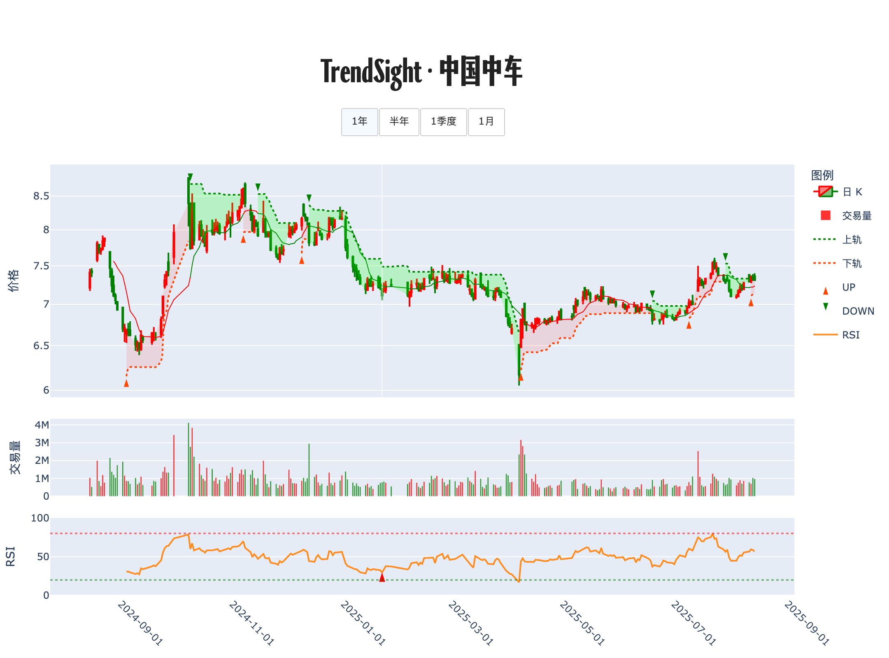

# 📊 交易诊断书 · 中国中车

**生成时间**: 2025-08-15 23:49:23  

## 走势脉络图

## 策略研判

<strong>上升趋势未破，价格回踩 10 日均价 7.25 附近、上方仍有最近信号价 7.34 的压制，守住 SuperTrend 7.14 做低吸，重返 7.25／7.34 再顺势加仓。</strong>

## 🔍 今日股票体检
日内 -0.82% 的小幅回撤，没有出现 ≥5% 的脉冲波动，成交量未提供，先以价格行为为主。整体处于「上升」状态，短线在 10 日均价 7.25 与 SuperTrend 支撑 7.14 之间消化，靠近支撑的均值回归弹性大于继续下探的概率。RSI14 为 52，位于中性带，既不亢奋也不超卖，策略上更偏向逢回撤靠近支撑试探、站回均线后跟进，而非追涨。今日无新趋势信号，上一笔为 2025-08-12 的买入信号 7.34，未见异常波动或明确当日背离提示。

## 🧭 计划与风控
若回踩至 SuperTrend 支撑 7.14 附近并出现止跌形态（例如低点不再下移、收出实体阳线），则先行试探性介入，仓位轻，确认不破后再逐步加回。

若收盘重返并稳定于 10 日均价 7.25 之上，且次日不再失守，则把试探仓提升为基准仓位，沿均线抬高防守。

若向上突破并两日稳在最近信号价 7.34 之上，则判定多头延续，执行趋势加仓，后续以 10 日均价为移动防线跟踪上移。

若有效跌破并收于 7.14 下方，则视为趋势减弱，立即降为防守仓或清仓观望，等待重新站回支撑或出现新的买点再参与。

仓位上限建议：基准仓位不超过总资金的 50%，趋势加仓至 75%，向上突破确认后再加至 100% 上限。止损与止盈规则：第一道防线以跌破 10 日均价或 SuperTrend 为准， fail-safe 以跌破前一信号位为准；止盈以价格偏离均值后回落触及 10 日均价为动态落袋依据。单笔风险控制在资金的 1%–1.5%，用「每股风险（入场价－止损价）」反推可买股数＝账户资金×风险比例÷每股风险。持续关注 RSI 与价格的背离演变，出现看涨背离优先做低吸加仓，出现看跌背离则优先兑现利润、缩减敞口。

---

TrendSight：计算你的计划。

