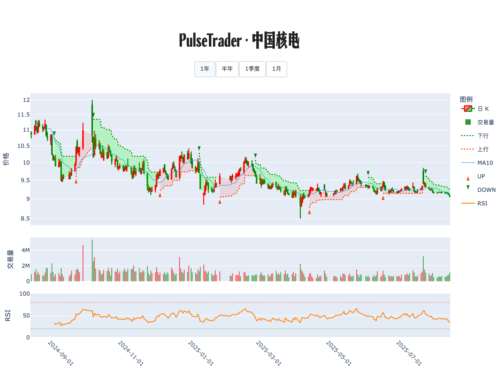

# 📊 交易诊断书 · 中国核电

**生成时间**: 2025-08-16 21:31:57  

## 走势脉络图

## 策略研判

<strong>趋势仍在下行、股价低于 10 日均价 9.15，RSI 33.5 未极端，量比 1.63 仅属活跃不异常——当前以防守与等待信号为主，不建议加杠杆</strong>

## 🔍 今日股票体检
节奏偏弱，日线收在 9.06，低于 10 日均价 9.15，短势仍走降。量比 1.63，成交活跃但未超 2.0 的异常区间，说明没有明确的放量转折。RSI14 为 33.5，偏弱但未到极端超卖，尚未看到清晰的「情绪背离」。系统最近一次信号是 2025-07-25 的 S（9.32），与当前的走弱相吻合，说明策略侧重防守。整体看，反转证据不足，贸然进攻胜算不高。

## 🧭 计划与风控
若日线有效收复并连续 2 天站稳 10 日均价，且量比放大至 ≥ 2.0，则试探性开底仓 10% 资金，止损放在 10 日均价下方一小格或最近「前低」下方，单笔风险控制在 1%–1.5%。

若出现「价格再创新低而 RSI 不再创新低」的明显「情绪背离」，且出现长下影的止跌形态，则左侧低吸 5%–8% 底仓，小仓验证，防守设在该低点下方，一旦跌破立刻退出。

若继续走弱并放量击穿前低，或 RSI 跌到 < 20 的极端超卖，则不抄底，等待 2–3 个交易日的缩量企稳，再看回抽至 10 日均价附近的承接强度决定是否重启试仓。

若强势放量上破近期平台并产生跟涨（量比 ≥ 2.0，回踩不破 10 日均价），则确认趋势切换后再把仓位逐步加到 15%–20%，止损随 10 日均价抬升移动，遇快速拉升可按均值回归分批止盈。

已持仓者，靠近 10 日均价的反抽优先做减压，保留现金等待更高胜率的信号；一旦跌破前低则执行止损，不做「赌反弹」。

关于杠杆，目前不建议加杠杆。仅在趋势翻多且满足「站上并走稳 10 日均价 ≥ 5 个交易日、回踩不破且量能配合」两项条件后，才可考虑低倍杠杆 ≤ 1.5x，同时把总仓位（含杠杆）控制在净值的 25% 以内，并将止损更紧以确保单笔风险不超过 1%–1.5%。

结论与信心：倾向等待，信心中等偏低，关键在于暂未出现放量、背离或平台突破三者之一的强信号。等待并不浪费时间，它是在买确定性。

---

PulseTrader：计算你的计划。

