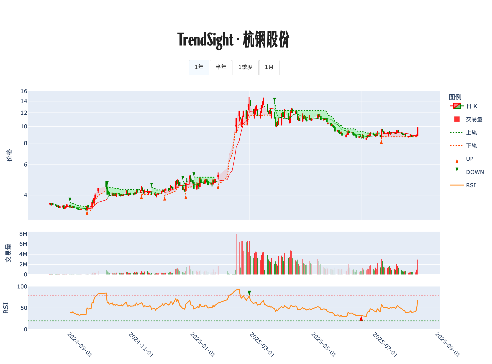

# 股票分析报告 · 杭钢股份

**生成时间**: 2025-08-15 11:38:20  

## 股票走势图

## AI 分析结果

## 个股体检
杭钢股份处于“上升”趋势内运行，最新系统信号为 2025-08-05 的买入 B(8.79)，今日无新信号。RSI14 在 58.6，偏强不极端；日内微跌 -0.21%，更像趋势中的正常呼吸。趋势下轨位于 9.06，MA10 在 9.03，均在当前交易的关键参考带。整体看，仍属健康的上升段落中继，核心在守住 9.06 一线与 MA10 之上运行。

## 今日数据分析：
日涨幅：-0.21%（温和回踩，不构成趋势破坏）
量化关系：价格小幅回落，量能数据未给出，按“弱回踩/窄幅整理”对待（是否缩量/放量暂不可判定）
趋势：上行（有效）
10 日均线 (MA10)：9.03。现价相对 MA10 未提供，设置参考：若价格偏离 MA10 超过 15%（约 10.38 以上），回归概率显著提高，宜分批落袋。
相对强度 (RSI)：58.6，处于50-70的趋势健康区间；不属>80的超买，也非<20的超卖。策略上以持有与逢回踩低吸优先，避免情绪化追高。

## 计划与风控指南：
各种走势情况的预案：
- 回踩但不破趋势下轨9.06与MA10=9.03：
视为健康回踩。已持有者继续持有；空仓/低仓者可在贴近9.06~9.03区间、出现企稳K线时分批试探性建仓。
- 日收盘有效跌破9.06，且次日不能快速收复：
趋势减弱信号。已持有者减仓至防守仓（例如减至总仓的30%或更低），等待重新站回下轨/MA10再恢复仓位；空仓者暂缓介入。
- 若进一步跌破并收于8.79下方（近期B信号成本）：
视为信号失败，趋势假破概率上升，执行清仓或仅保留极小观察仓，等待新的有效买点。
- 若出现放量长阳并延续上行（价格远离MA10）：
让利润奔跑，但遵循均值回归约束：当价格相对MA10偏离≥15%（约≥10.38）开始分批落袋（1/3→1/2），将浮盈转化为确定性。

风控建议：
- 仓位与凯利原则（保守半凯利/四分之一凯利）：趋势“上升”+RSI>50给出正期望倾向，但不确定性始终存在。建议用分层建仓：
1) 基础仓：20%–30%，建立在下轨9.06/MA10=9.03附近的确认性回踩后；
2) 趋势加仓：当价格沿上升趋势运行且站稳下轨之上，逐步加至40%–60%；
3) 突破加仓：若出现放量突破并成功换手，可短期加到最高不超过70%，并同步上移止盈线。
- 止损/止盈与动态跟踪：
- 首道防线：日收盘跌破9.06且无法快速收复，减半仓或降至轻仓；
- 失效止损：有效跌破8.79，全部离场，等待新的信号；
- 浮盈管理：价格＞MA10×1.15（约10.38）触发分批兑现；若RSI>80进入超买区，可再适度减仓以对冲回撤。
- 头寸风险控制：单笔交易风险控制在总资产的1%–1.5%。计算方法：计划止损价为S（如9.06或8.79），入场价为E，则仓位比例≈目标风险% ÷ ((E−S)/E)。例如在9.10附近入场、以9.06为止损、账户允许1%风险，仓位≈1% ÷ ((9.10−9.06)/9.10) ≈ 22%。
- 背离监控：若后续出现价格创新低而RSI未创新低的底背离，优先考虑低吸；若价格创新高而RSI不创新高的顶背离，优先落袋与降杠杆。
- 避免追涨：当价格快速拉开与MA10的距离，宁可等回踩靠近均线再布局，遵守均值回归。

总结：当前“上升趋势+RSI偏强+回踩不破关键均线/下轨”的组合，依旧是正期望的一侧。核心执行是“靠近9.06~9.03的分批低吸、失守则果断降低暴露、偏离MA10≥15%分段止盈”。让仓位随胜率与边际证据而生长，也随证据减弱而收缩。

---

*本报告由 TrendSight AI 自动生成，技术指标数据已持久化存储*
