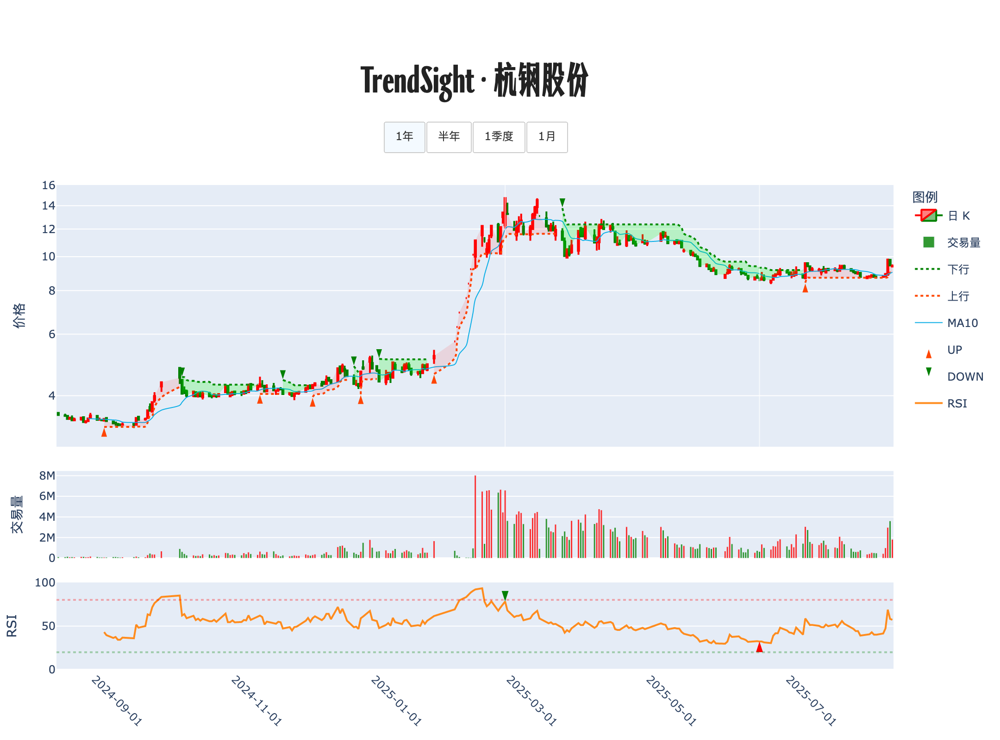

# 📊 交易诊断书 · 杭钢股份

**生成时间**: 2025-08-16 00:13:51  

## 走势脉络图

## 策略研判

<strong>上升趋势仍在，9.01–9.03 为当下防守带，今日小幅回落不改结构，优先靠近支撑低吸，跌破则快撤不恋战。</strong>

## 🔍 今日股票体检
日内下跌 0.42%，属于温和回调；当日成交量数据缺失，价量配合暂无法客观评估。中短期处于上升状态，价格正贴近「10 日均价 9.03 / SuperTrend 支撑 9.01」的重叠支撑区，均值回归概率中等，靠近支撑更有性价比。RSI14 为 57.2，处在中性偏强区间，策略上以「持有 + 回踩加仓」为主，不追高。今日系统无新信号，上一笔买入信号为 2025-07-08 的 B 9.58，暂未见明确情绪背离，后续留意价格创新高而 RSI 未同步创新高的「情绪衰竭」。

## 🧭 计划与风控
若回踩并收盘守住 9.01–9.03 区域，则执行低吸建底仓：以账户 1% 风险为上限，止损放在 9.01 下方 1.5%–2%，据此反推头寸规模；首笔不超过总资金 10%–15%。

若次日继续在 10 日均上方企稳，则做「趋势加仓」：再加同等或略低于首笔的仓位，使总仓提升至 15%–20%，止损随收盘价上移，始终位于 SuperTrend 下方约 1.5%–2%。

若有效上破阶段高点并收于突破位之上，则「突破加仓」至最多 25% 总仓；随即把动态止盈上调为「收盘跌破 10 日均则减仓一半」。

若收盘跌破 9.01 且次日未能收回，则执行防守撤退：当日或次日反弹无力即清仓，或采用硬止损触发（9.01 下方 1.5%–2%）避免亏损扩散。

若出现价格创新高而 RSI 未创新高的熊背离，则先行兑现 30%–50% 浮盈，并把余仓的止盈收紧到「10 日均下方不超过 1%」，直至背离被修复或趋势重新加速。

若 RSI 短线拉升至 80 以上并伴随加速阳线，则执行「情绪过热」的分批止盈，至少落袋三成仓位，保留不超过 15% 观察仓沿 10 日均跟踪。

补充与不确定性：数据来源为项目脚本指标快照（2025-08-15），当日成交量与阶段高点数值缺失，结论置信度为中等；一旦补齐量能与区间高低点，将据新数据做贝叶斯更新并调整仓位。

---

TrendSight：计算你的计划。

