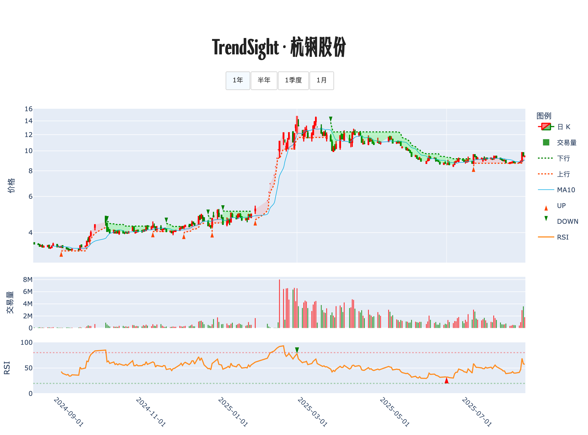

# 📊 交易诊断书 · 杭钢股份

**生成时间**: 2025-08-16 15:56:14  

## 走势脉络图

## 策略研判

<strong>上升趋势中的温和回撤，股价 9.40 仍在 10 日均价 9.03 之上但低于前次 B 信号 9.58，短线以 9.03 为支撑、9.58 为压力，操作以「回踩低吸、小仓试错，突破再加码」为主。</strong>

## 🔍 今日股票体检
趋势仍为上升，今天小幅回落，属于正常波动。价格运行在 10 日均价之上，说明多头节奏未被破坏，但 9.58 的前次 B 信号价在头顶，会形成一定抛压，短线需要时间消化。成交上，量比 1.07 为常态水平，没有出现脉冲式放量或极度缩量，市场情绪平稳。RSI 57.2 也处于中性区间，没有极端或突发的「情绪背离」。综合来看，结构健康但缺少立即性信号，耐心等待边际变化更占优势。

## 🧭 计划与风控
若股价回踩并在 10 日均价 9.03 附近缩量企稳，则先开 1/3 仓位试错（不超过总资金 10%），以 10 日均价为第一道防守线，收盘有效跌破且两日不收回则减半，再失守前低则清仓。单笔风险控制在资金的 1%–1.5%。

若放量突破并收于 9.58 之上，且量比升至 2.0 以上，则在已有仓位上加码至 20%–25% 总仓，并把防守线上移到 9.58 上方，后续回踩不破可再做小幅跟进。

若收盘跌破 10 日均价，且下跌伴随放量（量比 ≥ 2.0 的长阴），说明弱势确认，迅速降至 0–1/3 仓位，等待重新站回 10 日均价且量能恢复后再参与，避免在加速阶段硬扛。

若持续横盘且量比低迷至 0.5 以下，则保持观望，不追不减，让时间换空间；等到靠近 10 日均价的缩量回踩或有效放量突破 9.58，再按上面的两条路径执行。

若出现单日 ≥ 5% 的快速拉升且量比 > 2.0，短线可能过热，可对已有利润分批兑现约 1/3，待回踩 9.58 或 10 日均价并稳住再接回，实现顺势高抛低吸。

当前信号常态、确定性一般，耐心等待「靠近 9.03 的低吸」或「放量站上 9.58 的确认」两类高把握度时机更有胜率。我的结论是先小、后大，先慢、后快，用仓位的「贝叶斯式」加减去对冲不确定性。

---

TrendSight：计算你的计划。

