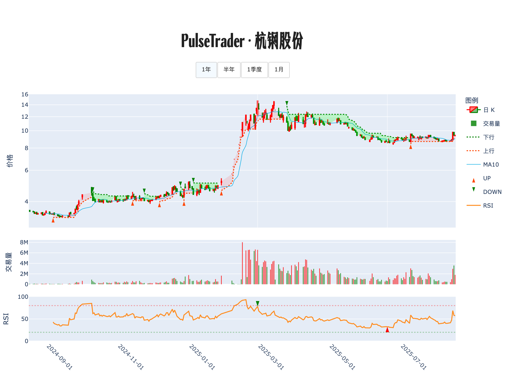

# 📊 交易诊断书 · 杭钢股份

**生成时间**: 2025-08-18 11:39:21  

## 走势脉络图

## 策略研判

<strong>上升趋势仍在、量能平稳、价格略高于 10 日均价，最优策略是等回踩企稳再低吸，突破再小加，跌破则果断防守。</strong>

## 🔍 今日股票体检
趋势保持向上，收盘小跌 0.42%，整体是温和回撤并未破坏结构。价格运行在 10 日均价之上，说明多头仍占主动，但并不便宜，左侧介入需要更好的胜率位置。量比 1.07，成交活跃度正常，没有异常脉冲，市场情绪偏平稳。RSI 57 附近，情绪不极端，暂未给出「情绪背离」之类的强信号。最新的「B 信号」在 7 月 8 日出现，当前价略低于该触发价，属于对前期拉升的回撤消化，并非趋势转弱的证据。现阶段更像是在构建一个小平台，第一支撑看「10 日均价」，压力留给「近期平台上沿」。

数据来源：用户提供的 2025-08-15 指标快照；关键信号暂无新增，需以价格与量能变动为准。

## 🧭 计划与风控
若回踩到「10 日均价」附近并缩量企稳，当天或次日收盘站稳，则分批低吸建仓 10%–15% 仓位，初始止损放在「10 日均价」下方，采用收盘确认跌破再执行，单笔风险控制在总资金的 1%–1.5%。

若回踩后快速拉起并以温和放量收复当日回撤，高于前一日高点收盘，则在已建底仓基础上顺势加 5%–8% 仓位，保护性止损上移至回踩低点下方，防止二次探底。

若放量突破「近期平台上沿」并能以放量阳线收在平台之上，再小幅追随加 5%–7% 仓位，失败保护设在突破位下方，若次日缩量跌回平台内则减回这一笔，避免假突破扩亏。

若收盘有效跌破「10 日均价」且量比放大至明显异常（例如 > 2.0），暂不抄底，耐心等待重新站回并出现缩量回测确认，再恢复计划；若随后跌破前一个显著「前低」，则空仓观望，等待新的「B 信号」或明确的看涨背离。

若单日上涨 ≥ 5% 且放量，或价格对「10 日均价」出现明显乖离同时 RSI 短线冲至高位（例如 > 80），则对已有仓位分批兑现 1/3，落袋为安，余仓以「10 日均价」为移动防线，顺势持有。

若出现价格创新高而 RSI 未创新高的「看跌背离」，视为情绪透支的警报，优先把仓位降至 1/3，等待回到「10 日均价」附近再评估；反之若回调中出现价格不创新低而 RSI 创出更高低点的「看涨背离」，可在「10 日均价」附近优先加回减掉的那一笔。

总仓控制不超过 25%，严格执行分批进出与收盘价确认。当前无强信号，耐心等待上述触发条件，是胜率与赔率更均衡的选择。信心评估：中等；一旦量能或背离信号出现，将动态更新方案。

---

PulseTrader：计算你的计划。

