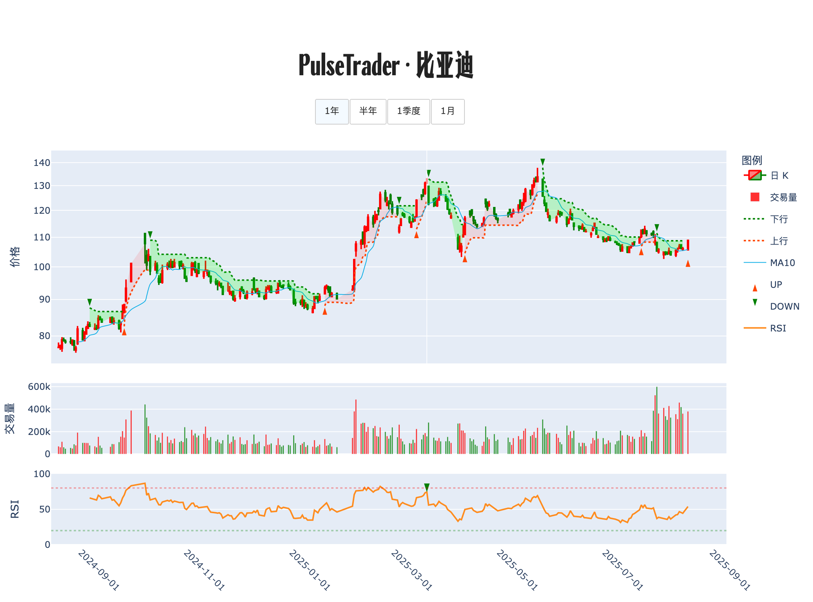

# 📊 交易诊断书 · 比亚迪

**生成时间**: 2025-08-18 15:15:38  

## 走势脉络图

## 策略研判

<strong>趋势向上、价在 10 日均线上方、今天新出 B 信号但量能平稳，先小仓试多，等回踩 10 日均线再加码，防守放在 10 日线与前低之下。</strong>

## 🔍 今日股票体检
依据你提供的数据：收盘 108.94，日涨幅 2.71%，10 日均价 105.79，成交量正常、量比 1.00，RSI 14 为 53.9，中性不极端；趋势标注为上升，最新信号为 2025‑08‑18 的 B @ 108.94。价格站上 10 日均线且不远，性价比尚可；量能没有异常放大，说明买盘启动但不亢奋，追价收益‑风险一般。RSI 不在极端区，没有可用的「情绪背离」或过热信号，更多属于常态推进。

## 🧭 计划与风控
若明后天回踩到 10 日均价附近并出现缩量企稳、下影线止跌的形态，则在 10 日均线 ±1% 的价格带分批加到计划仓位的 50%，把单笔风险控制在总资金的 1%–1.5%。

若不回踩而是放量上攻并有效突破今日高点，且量比 ≥ 2，再追一成仓作为趋势加仓；若量比仍接近 1，则不追，耐心等回踩给更好的性价比。

若收盘跌回 10 日均线之下且成交放大，则先减仓至一半；将剩余仓位的「失败保护」止损放在上一波回撤低点之下，彻底跌破则清仓离场，严格执行。

若短期拉升远离 10 日均线且 RSI 升至 80 以上，或出现「价涨量缩」的疲态，则分批兑现三分之一利润，回落靠近 10 日均线再找二次上车点。

若回踩过程中出现「价格创新低而 RSI 未创新低」的看涨情绪背离，在支撑区优先加仓；若没有出现，则维持轻仓观望，不勉强出手。

初始只用小仓位试单，按「仓位 = 可承受亏损 /（入场价 − 防守位）」计算，确保跌到第一防守位最多亏总资金的 1%–1.5%。在信号未强化前，单一标的总敞口上限建议不超过总资金的 10%–12%，仅在放量突破且回踩确认后再考虑提升，但不超过 25% 的绝对上限。

整体看，这是一个温和的顺势做多窗口，但缺少放量与极端情绪背书，最佳策略是轻仓先行、回踩加码、以 10 日均线为第一道防线、前低为最后防线。信号未明朗时，等待是盈利的一部分。

---

PulseTrader：计算你的计划。

