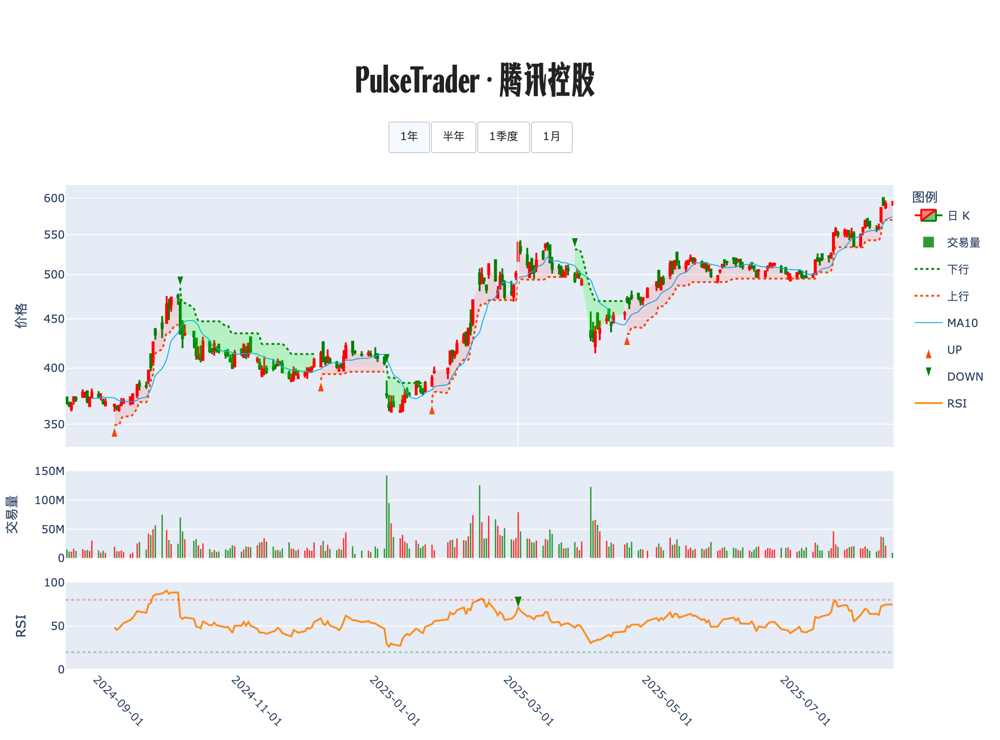

# 📊 交易诊断书 · 腾讯控股

**生成时间**: 2025-08-18 12:18:03  

## 走势脉络图

## 策略研判

<strong>上涨趋势仍在、价格高于 10 日均价但今日成交清淡，情绪偏热不极端，策略上不追高，等靠近 10 日均价的回踩再布局，持有者以 10 日均价为第一道止盈止损线。</strong>

## 🔍 今日股票体检
趋势是上升的，这是核心。收于 594，站在 10 日均价 573.8 上方约一个台阶，说明多头占优。今天的量比仅 0.39，属于明显缩量，上涨 0.34% 更像是「无人跟随的抬升」，不是强势推进，这降低了即时跟随的胜率。RSI14 在 75，偏热但未到极端区间，短线再拉会更容易引发回吐。今日无新信号，上一笔策略信号是 2025‑04‑23 的买入 469.7，中线持有仍然顺势，但需要收紧防线。

## 🧭 计划与风控
如果回踩并在 10 日均价附近企稳，出现下影线或量能恢复至常态（量比≥1），则左侧分批开仓，先用计划总仓位的 30% 建底，单笔风险控制在资金的 1% 以内，初始止损放在 10 日均价下方适度空间或最近低点下方，二选一取更紧的那个。

如果缩量横盘 3–5 天，等 10 日均价上移贴近现价且 RSI 回落后再拐头向上，则小仓试探切入 20% 左右，用均价线作为第一道止损，失败就小亏出局，避免被来回抽打。

如果放量突破并有效站稳近期高点，要求「收盘放量、量比≥2.0 且实体阳线明显」，再顺势加仓 10%–15%，同时把整体止损抬到 10 日均价之上，防止假突破回落吞噬利润。

如果收盘跌破 10 日均价且次日不能快速收复，或伴随放量长阴，则减仓到轻仓或观望，已建底的仓位先减一半，剩余仓位以前低为失效位，跌破则清空，整笔亏损仍不超过资金的 1%–1.5%。

如果出现单日大涨 ≥5% 且量能放大到异常，短线情绪过热，持有者可趁势主动兑现 1/3，等待回落到 10 日

---

PulseTrader：计算你的计划。

